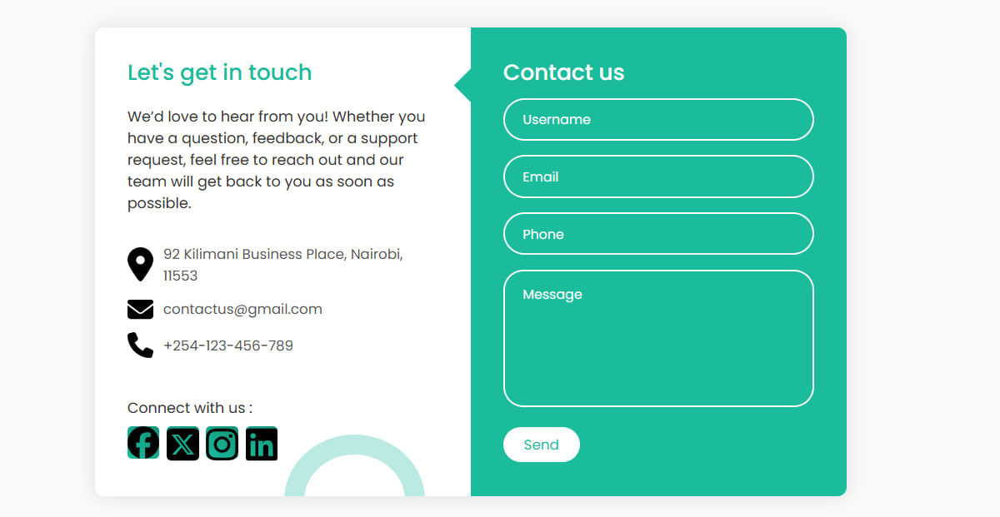

# 💬 Simple Contact Page

A responsive contact page built with HTML, CSS, and JavaScript. It includes contact information, a user-friendly form, and social media links — styled for both desktop and mobile users.

)

## 🚀 Project Overview

This project is part of a collaborative development simulation. The goal is to:

- Practice using Git branches and pull requests
- Learn how to resolve merge conflicts
- Build a functional and visually appealing contact form

## 🛠️ Tech Stack

- HTML5 – Page structure
- CSS3 – Styling and layout
- JavaScript – (Optional) Form interactions or animations

## ✨ Features

- Responsive design (desktop, tablet, mobile)
- Left side: contact info + icons
- Right side: contact form
- Social media icons
- Custom shapes and layout styling

## 🔧 How to Run Locally

1. Clone the repository:

   `bash
   git clone https://github.com/Boaz-marube/contactPage
   cd contactPage

2. Open the project in VS Code (or any code editor):
   code .
3. Open index.html in your browser:

   Right-click the index.html file > Open with Browser
   Or use a Live Server extension in VS Code

---

## 🙌 Contributors

| Name           | Contribution Areas                                                                                                 |
| -------------- | ------------------------------------------------------------------------------------------------------------------ |
| Boaz MARUBE    | 🔹 Created the GitHub repository   🔹 Developed the HTML structure   🔹 Implemented JavaScript functionality |
| Bereket Eshete | 🔹 Designed and implemented the CSS layout   🔹 Created and organized the README.md file                        |

We collaborated on resolving merge conflicts, conducting peer reviews, and testing the final product together. 💻✨

| [Boaz MARUBE](https://github.com/Boaz-marube) | 🔹 ... |
| [Bereket Eshete](https://github.com/Bereket-Eshete) | 🔹 ... |
